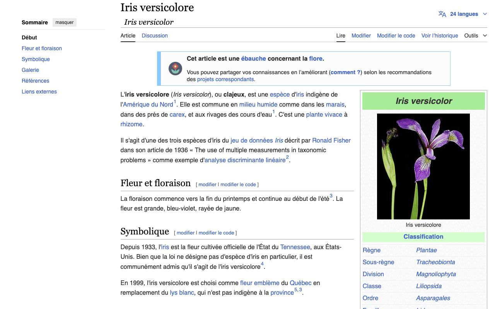

AnkiLingoFlash is a powerful browser extension that automates the creation of Anki flashcards for language learning. Currently available for Chrome and Firefox, with Edge support coming soon, it seamlessly integrates with your browsing experience to enhance your language acquisition process.



## 📖 Table of Contents
- [Why Choose AnkiLingoFlash?](#-why-choose-ankilingoflash)
- [Installation](#-installation)
- [Initial Setup](#️-initial-setup)
- [Usage](#️-usage)
- [Contributing](#-contributing)
  - [Project Structure](#️-project-structure)
  - [Future Improvements](#-future-improvements)
- [License](#️-license)
- [Acknowledgements](#-acknowledgements)

## 💡 Why Choose AnkiLingoFlash?

- **Enriched Flashcards**: Create comprehensive flashcards with a direct translation, a definition, a mnemonic, and a pronunciation guide.
- **Seamless Anki Integration**: Generate and add cards to Anki directly from your browser, without typing and disrupting your daily routine.
- **Personalised Learning**: Create personalised flashcard sets tailored to your interests, no more downloading uncertain quality decks.
- **Distraction-Free**: No ads, just pure focus on your language learning journey.
- **Flashcard Independence**: All flashcards created with AnkiLingoFlash remain in your Anki deck, even if you stop using the extension.
- **Affordable Learning**: Start with a generous free trial, then continue at minimal cost using your own AI credits - I don't charge any markup!

Integrate AnkiLingoFlash into your daily browsing routine and watch your vocabulary grow day by day. 🌱

## 🔧 Installation

### For Users

Visit the [installation page](https://ankilingoflash.com/installation.html) for step-by-step instructions on installing AnkiLingoFlash for Chrome or Firefox. Edge support is coming soon!

### For Developers

1. Clone the repository:
   ```
   git clone https://github.com/pictoune/AnkiLingoFlash.git
   ```
2. Install dependencies:
   ```
   npm install
   ```
3. Set up your Google OAuth 2.0 credentials:
   - Go to the [Google Cloud Console](https://console.cloud.google.com/)
   - Create a new project or select an existing one
   - Navigate to "APIs & Services" > "Credentials"
   - Click "Create Credentials" and select "OAuth client ID"
   - Set up the OAuth consent screen if you haven't already
   
   For Chrome:
   - Choose "Chrome Extension" as the application type
   - Enter your Chrome extension ID (you can find this in `chrome://extensions` when you load the unpacked extension)
   
   For Firefox:
   - Choose "Web application" as the application type
   - To get your redirect URL:
     1. Load your extension in Firefox (see step 6 below)
     2. Go to `about:debugging#/runtime/this-firefox`
     3. Find your extension and click on "Inspect"
     4. In the console that opens, type `browser.identity.getRedirectURL()` and press Enter
     5. Copy the URL that is returned
   - Add this URL to the "Authorized redirect URIs" in your Google Cloud Console project

4. Add your Client ID to the appropriate `manifest.json` file based on the browser you're developing for:

   - For Chrome: `src/browser-specific/chrome/manifest.json`
   - For Firefox: `src/browser-specific/firefox/manifest.json`
   - For Edge: `src/browser-specific/edge/manifest.json`

   Update the `oauth2` section in the manifest file:
   ```json
   "oauth2": {
     "client_id": "YOUR_CLIENT_ID_HERE",
     "scopes": ["https://www.googleapis.com/auth/userinfo.email", "https://www.googleapis.com/auth/userinfo.profile"]
   }
   ```

5. Build the extension for all supported browsers:
   ```
   ./build.sh
   ```

6. Load the extension in your browser:
   - Chrome: Navigate to `chrome://extensions/`, enable "Developer mode", click "Load unpacked", and select the `dist/chrome` directory.
   - Firefox: Go to `about:debugging#/runtime/this-firefox`, click "Load Temporary Add-on", and choose any file in the `dist/firefox` directory.
   - Edge: Support coming soon!

## ⚙️ Initial Setup

After installation, it's crucial to configure AnkiLingoFlash properly. Follow the [quick tutorial](https://ankilingoflash.com/quick-tutorial.html) to set up the extension. This one-time process, which takes less than 5 minutes, is required for the extension to function properly.

## 🖱️ Usage

1. Sign in with your Google account or enter your OpenAI API key in the extension settings.
2. Browse to a webpage in your target language.
3. Select the text you want to create a flashcard for.
4. Right-click and choose "Generate a flashcard" from the context menu.
5. In the popup, review and edit the generated flashcard content. Click "Validate" to confirm.
6. Select your preferred Anki deck. If language detection was unsuccessful, manually specify the language for accurate pronunciation guides.
7. The flashcard is now added to your chosen Anki deck, ready for review!

## 🌍 Contributing

I welcome contributions to AnkiLingoFlash! Whether you're fixing bugs, adding features, or improving documentation, your help is appreciated.

To contribute:
1. Fork the repository
2. Create your feature branch (`git checkout -b feature/AmazingFeature`)
3. Commit your changes (`git commit -m 'Add some AmazingFeature'`)
4. Push to the branch (`git push origin feature/AmazingFeature`)
5. Open a Pull Request

For major changes or ideas, please open an issue first to discuss what you would like to change. If you prefer, you can also reach out to me directly—my contact information is available on the [about page](https://ankilingoflash.com/about.html#-get-in-touch).

### 🗂️ Project Structure

The project is organized as follows:

```
AnkiLingoFlash/
├── src/
│   ├── browser-specific/
│   │   ├── chrome/
│   │   ├── edge/
│   │   └── firefox/
│   ├── common/
│   └── config.js
├── _locales/
├── icons/
├── dist/
├── build.sh
├── package.json
└── README.md
```

- `src/common/`: Shared code across all browsers
- `src/browser-specific/`: Browser-specific implementations
- `_locales/`: Localization files
- `icons/`: Extension icons
- `dist/`: Output directory for built extensions
- `build.sh`: Build script for generating browser-specific distributions

### 🤖 Future Improvements

I'm always looking to enhance AnkiLingoFlash. Here are key areas for improvement:

1. **Local LLM Integration**: Implement a browser-based local Language Model for 100% free and offline use.
2. **Web Scraping for Definitions**: Use the local LLM to search the internet for accurate, cited definitions.
3. **Adjustable Model Temperature**: Allow users to control the AI's creativity level in generating content.
4. **Code Refactoring and Testing**: Improve code quality, reduce redundancy, and implement comprehensive testing.
5. **Automated Initial Setup**: Streamline the configuration process for a smoother user experience.

If you're interested in tackling any of these improvements or have other ideas, I'd love to hear from you!

## ⚖️ License

This project is licensed under the [GNU Affero General Public License v3.0 (AGPL-3.0)](LICENSE).

**Important:** Commercial use of this software is prohibited unless explicit permission is granted by the original author. Commercial use includes, but is not limited to, selling the software, incorporating it into a product or service that is sold, or using it in a commercial environment without proper licensing from the author.

## 🙏 Acknowledgements

Special thanks to the following projects and resources that made AnkiLingoFlash possible:

- [Anki](https://apps.ankiweb.net/): For their excellent spaced repetition software.
- [AnkiConnect](https://github.com/FooSoft/anki-connect): A powerful Anki plugin that allows external applications to communicate with Anki.
- [AwesomeTTS](https://github.com/AwesomeTTS/awesometts-anki-addon): An add-on that provides text-to-speech capabilities for Anki, enhancing the learning experience.
- [OpenAI](https://openai.com/): For the ChatGPT API powering our flashcard generation.

Their contributions have been invaluable in the development of this extension.